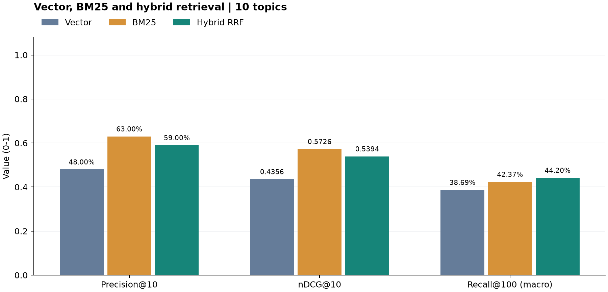
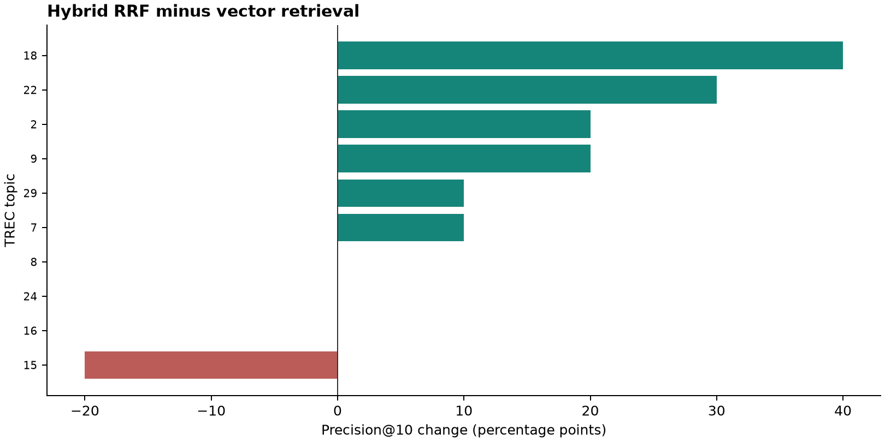

# TREC 2019 hybrid retrieval evaluation

[中文](trec2019_chroma_retrieval.zh-CN.md) | English · [Indexing and MCP tutorial](../examples/chroma_mcp/README.md)

Compare vector retrieval, BM25 and RRF fusion over the same **8,567 clinical trials**. A fixed seed of **42** selects 10 of the 38 judged topics: **2, 7, 8, 9, 15, 16, 18, 22, 24, 29**. Every method uses the same queries. [Query texts](assets/trec2019/hybrid/topics.csv)

## Method

| Item | Setting |
| --- | --- |
| Queries | Disease, gene/variant and demographics from `topics2019.xml`, joined with spaces |
| Judgments | `qrels-treceval-trials.38.txt`; topics 32 and 33 have no judgments and are excluded from sampling |
| Vector | BGE-small-en-v1.5, normalized embeddings, cosine distance; 43,459 context-enriched narrative chunks |
| BM25 | One complete Markdown file per document; lowercase tokenization with `[a-z0-9]+` |
| Candidates | Increase vector chunk retrieval until 100 distinct trials are available; BM25 returns 100 trials |
| Fusion | `EnsembleRetriever`, weights 0.5/0.5, RRF `c=60`, fusion by NCT ID |

P@10 and nDCG@10 score the first 10 trials; Recall@100 scores the first 100. Grades 1 and 2 count as relevant, unjudged results score zero, and nDCG gain is `2**grade - 1`. Recall divides retrieved relevant trials by all judged relevant trials for that topic. Metrics are computed per query and averaged over the 10-query sample.

## Results

| Method | P@10 | nDCG@10 | Recall@100 |
| --- | ---: | ---: | ---: |
| Vector | 48.00% | 0.4356 | 38.69% |
| BM25 | **63.00%** | **0.5726** | 42.37% |
| Hybrid RRF | 59.00% | 0.5394 | **44.20%** |



BM25 has the strongest top-10 ranking, while hybrid retrieval has the highest top-100 recall. Equal-weight fusion does not outperform BM25 on every metric in this sample.



The second plot compares hybrid with vector retrieval: **6 queries improve, 1 decreases, and 3 tie**. It does not compare hybrid with BM25.

## Reproduce

Open [05_evaluate_retrieval.ipynb](../examples/chroma_mcp/05_evaluate_retrieval.ipynb), set the document, index and output paths in **Configuration**, and run the cells in order. Executed outputs and charts are included in the notebook. Sampling settings:

```python
sample_size = 10
sample_seed = 42
candidate_count = 100
```

The notebook loads existing indexes without rebuilding them. Saved files include [per-query metrics](assets/trec2019/hybrid/per_topic.csv), [3,000 ranked results](assets/trec2019/hybrid/ranking.csv), [candidate counts](assets/trec2019/hybrid/candidates.csv), and [configuration and input hashes](assets/trec2019/hybrid/summary.json).

This evaluation uses 100 distinct trials per branch. The MCP service still retrieves 100 vector chunks before deduplication, so these scores apply to the notebook's candidate settings. The corpus is the subset referenced by qrels; scores are not directly comparable with official full-corpus runs, and unjudged trials are not necessarily irrelevant. [TREC dataset](https://pages.nist.gov/trec-browser/trec28/pm/data/)
