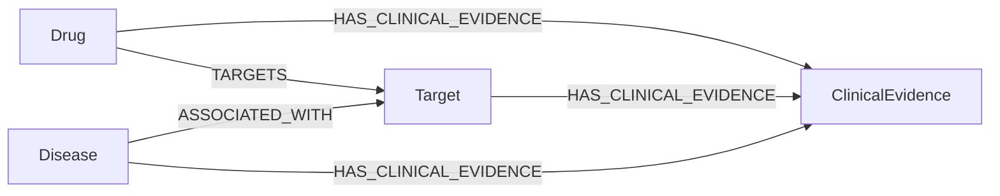

# Neo4j MCP demo

English | [中文](README.zh-CN.md)

Build a drug–target–disease graph from Open Targets data and query it through BioPaster using the [official Neo4j MCP server](https://github.com/neo4j/mcp).

## Files

| File | Purpose |
| --- | --- |
| [01_prepare_graph_data.ipynb](01_prepare_graph_data.ipynb) | Download Open Targets 26.06 data and prepare node and relationship tables |
| [02_import_graph.ipynb](02_import_graph.ipynb) | Import the tables into Neo4j |
| [docker-compose.yml](docker-compose.yml) | Start Neo4j with APOC; allow writes during import |
| [docker-compose.readonly.yml](docker-compose.readonly.yml) | Make the database read-only after import |
| [mcp_config.example.json](mcp_config.example.json) | Connect BioPaster to the official MCP server |

## 1. Set up the environment

Use Python 3.12, Docker Compose, `rsync`, and [uv](https://docs.astral.sh/uv/getting-started/installation/). From the repository root:

```bash
cd examples/neo4j_mcp
python -m pip install -r requirements.txt
cp .env.example .env
```

Set `NEO4J_PASSWORD` in `.env`. Use this same password for the notebook and MCP connection. Run notebooks with this directory as their working directory.

## 2. Prepare the data

Run [01_prepare_graph_data.ipynb](01_prepare_graph_data.ipynb) in order. It downloads the Open Targets 26.06 datasets into `data/` and writes tables to `data/graph_data/`.

The download cell includes full association and clinical-evidence datasets; sampling happens later, during import. Its `rsync --delete` commands synchronize the drug dataset directories, so keep `data/` dedicated to this example. The Europe PMC download is not used by the graph import and can be skipped.

The notebook changes its working directory to `data/`. Restart the kernel before rerunning it from the beginning.

Two filenames need to agree with the import notebook:

| Preparation output | Import input | Adjustment in the import notebook |
| --- | --- | --- |
| `nodes/targets.parquet` | `nodes/targets.csv` | Use `pd.read_parquet("data/graph_data/nodes/targets.parquet")` |
| `edges/drug_target.cparquet` | `edges/drug_target.parquet` | Read `"data/graph_data/edges/drug_target.cparquet"` with `pd.read_parquet` |

The `.cparquet` file contains Parquet data despite its filename.

## 3. Start Neo4j and import

If another database already uses ports 7474 or 7687, stop that instance first or change this example's ports and connection URI together.

```bash
docker compose --env-file .env up -d
docker compose logs -f neo4j
```

Wait for the database to finish starting. `Ctrl+C` exits the log display; the container continues running. The browser is available at <http://localhost:7474>.

Open [02_import_graph.ipynb](02_import_graph.ipynb) with a fresh kernel. Update the environment-file path:

```python
load_dotenv(".env")
PASSWD = os.getenv("NEO4J_PASSWORD")
```

Skip its Docker startup cell because the container is already running. Apply the two filename adjustments above, then run the import cells in order against an empty database.

The notebook imports target, disease, and drug nodes; samples 20,000 disease–target rows and 50,000 clinical-evidence rows with `random_state=42`; and imports the drug–target table. The sampled row counts are not guaranteed to equal the final relationship counts.



Two details matter when reusing this importer:

- `TARGETS` uses `CREATE`; rerunning that import adds duplicate relationships.
- `ASSOCIATED_WITH` uses one relationship per disease–target pair. If multiple datasources occur for the same pair, later rows overwrite its `datasource`, `score`, and `evidence_count`. To retain each source separately in your own graph, include `datasource` in the relationship's `MERGE` key.

`score` on an association is imported data, not vector similarity. `ClinicalEvidence.report_id` can contain an NCT identifier or another identifier format. The notebook's final query is an optional usage example.

## 4. Switch to read-only access

After importing, close the notebook's driver:

```python
driver.close()
```

Apply the read-only configuration. The data stays in `neo4j/data/`.

```bash
docker compose --env-file .env \
  -f docker-compose.yml -f docker-compose.readonly.yml up -d
```

Use both Compose files for subsequent starts. To import more data later, start with only `docker-compose.yml`, complete the import, and apply the read-only override again.

## 5. Connect BioPaster

Find the executable path:

```bash
command -v uvx
```

Copy the `neo4j` entry from [mcp_config.example.json](mcp_config.example.json) into `mcpServers` in `~/.biopaster/config.json`. Replace `/absolute/path/to/uvx` with the path above and retain any existing entries, such as Chroma.

The configuration starts `neo4j-mcp-server==1.6.0` through stdio. BioPaster launches it automatically. APOC supplies schema information, and `NEO4J_MCP_READ_ONLY=true` disables the write tool.

Load the password and launch BioPaster in the same terminal:

```bash
source .env
export NEO4J_PASSWORD
biopaster
```

The two tools used here are:

| Tool | Purpose |
| --- | --- |
| `mcp__neo4j__get-schema` | Read node labels, relationship types, and properties |
| `mcp__neo4j__read-cypher` | Execute a read-only Cypher query |

## 6. Ask questions

Start with the schema:

```text
Use the Neo4j MCP tool to inspect the graph schema and explain the node labels and relationship directions.
```

Then query the graph:

```text
Find up to 10 targets associated with diseases whose names contain "melanoma".
Return the disease name, target symbol, datasource, and association score, sorted by score descending.
Show the Cypher query you executed.
```

```text
Find drugs connected to the target with symbol "BRAF" through TARGETS.
Return distinct drug names, action types, and mechanisms, limited to 10 rows.
```

```text
Find clinical evidence linked to BRAF through HAS_CLINICAL_EVIDENCE.
Return up to 10 distinct report IDs and their stages. Do not infer treatment efficacy from these records.
```

A query returning no records means no matching records were found in this graph. The disease–target and clinical-evidence imports are samples.

## Use your own graph

Import your own node labels, relationships, and properties, then update the MCP URI, database name, and credentials. The official server exposes schema inspection and Cypher execution, so changing from drug–target data to genes or pathways does not require a new BioPaster tool.

For a different graph, ask BioPaster to inspect its schema before querying it. Keep domain-specific relationship meanings and identifier conventions in the dataset documentation.

## Stop Neo4j

```bash
docker compose stop neo4j
```

`restart: "no"` leaves startup under your control. The database files remain on disk.
