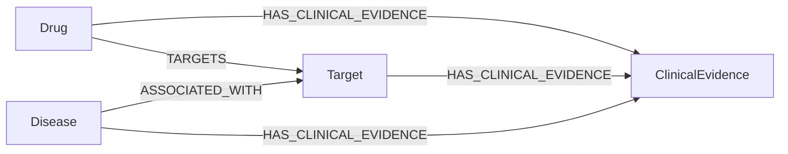

# Neo4j MCP 示例

[English](README.md) | 中文

使用 Open Targets 数据建立药物–靶点–疾病图谱，通过 [Neo4j 官方 MCP 服务](https://github.com/neo4j/mcp)让 BioPaster 查询。

## 文件

| 文件 | 用途 |
| --- | --- |
| [01_prepare_graph_data.ipynb](01_prepare_graph_data.ipynb) | 下载 Open Targets 26.06 数据，整理节点和关系表 |
| [02_import_graph.ipynb](02_import_graph.ipynb) | 将表导入 Neo4j |
| [docker-compose.yml](docker-compose.yml) | 启动带 APOC 的 Neo4j，导入阶段允许写入 |
| [docker-compose.readonly.yml](docker-compose.readonly.yml) | 导入后将数据库设为只读 |
| [mcp_config.example.json](mcp_config.example.json) | 为 BioPaster 配置官方 MCP 服务 |

## 1. 准备环境

需要 Python 3.12、Docker Compose、`rsync` 和 [uv](https://docs.astral.sh/uv/getting-started/installation/)。在仓库根目录执行：

```bash
cd examples/neo4j_mcp
python -m pip install -r requirements.txt
cp .env.example .env
```

在 `.env` 中设置 `NEO4J_PASSWORD`。Notebook 和 MCP 连接使用同一个密码。运行 Notebook 时，工作目录应为当前示例目录。

## 2. 准备数据

按顺序运行 [01_prepare_graph_data.ipynb](01_prepare_graph_data.ipynb)。数据下载到 `data/`，整理后的表保存在 `data/graph_data/`。

下载单元包含完整的关联数据和临床证据数据，抽样在后面的导入阶段进行。其中 `rsync --delete` 会同步药物数据目录，因此 `data/` 应专用于本示例。Europe PMC 下载项未用于本次图谱导入，可以跳过。

Notebook 会将工作目录切换到 `data/`。从头重新运行前，请先重启内核。

准备和导入 Notebook 中有两处文件名需要对齐：

| 准备阶段输出 | 导入阶段读取 | 在导入 Notebook 中调整 |
| --- | --- | --- |
| `nodes/targets.parquet` | `nodes/targets.csv` | 改为 `pd.read_parquet("data/graph_data/nodes/targets.parquet")` |
| `edges/drug_target.cparquet` | `edges/drug_target.parquet` | 用 `pd.read_parquet` 读取 `"data/graph_data/edges/drug_target.cparquet"` |

`.cparquet` 文件的实际内容仍是 Parquet。

## 3. 启动 Neo4j 并导入

如果已有数据库占用了 7474 或 7687 端口，先停止该实例，或同步修改本示例的端口和连接地址。

```bash
docker compose --env-file .env up -d
docker compose logs -f neo4j
```

等待数据库启动完成。`Ctrl+C` 退出日志显示，容器继续运行。浏览器管理页面位于 <http://localhost:7474>。

使用新内核打开 [02_import_graph.ipynb](02_import_graph.ipynb)，将环境文件路径改为：

```python
load_dotenv(".env")
PASSWD = os.getenv("NEO4J_PASSWORD")
```

容器已启动，跳过 Notebook 中的 Docker 启动单元。按上表调整两处文件名，再依次执行导入单元，目标应为空数据库。

Notebook 导入靶点、疾病和药物节点；以 `random_state=42` 抽取 20,000 条疾病–靶点记录、50,000 条临床证据记录；并导入药物–靶点表。抽取的记录数不一定等于最终关系数。



复用导入代码时，需要注意两点：

- `TARGETS` 使用 `CREATE`，重复运行这一段会增加重复关系。
- `ASSOCIATED_WITH` 为每个疾病–靶点对保留一条关系。同一对实体有多个数据源时，后面的记录会覆盖 `datasource`、`score` 和 `evidence_count`。自己的图谱若需分别保留各来源，应将 `datasource` 加入关系的 `MERGE` 键。

关联上的 `score` 来自原始数据，不是向量相似度。`ClinicalEvidence.report_id` 可能是 NCT 编号，也可能是其他格式的标识符。Notebook 最后的查询可作为使用示例，按需运行。

## 4. 切换为只读

导入结束后，关闭 Notebook 中的连接：

```python
driver.close()
```

应用只读配置，数据仍保存在 `neo4j/data/`：

```bash
docker compose --env-file .env \
  -f docker-compose.yml -f docker-compose.readonly.yml up -d
```

后续启动时仍使用这两个 Compose 文件。需要追加导入时，先只使用 `docker-compose.yml` 启动，导入完再应用只读配置。

## 5. 接入 BioPaster

查找可执行文件路径：

```bash
command -v uvx
```

将 [mcp_config.example.json](mcp_config.example.json) 中的 `neo4j` 配置加入 `~/.biopaster/config.json` 的 `mcpServers`，把 `/absolute/path/to/uvx` 替换为上面的实际路径。保留已有的 Chroma 等配置。

该配置通过 stdio 启动 `neo4j-mcp-server==1.6.0`，由 BioPaster 自动启动服务。APOC 提供图谱结构信息，`NEO4J_MCP_READ_ONLY=true` 禁用写入工具。

在同一个终端中加载密码并启动 BioPaster：

```bash
source .env
export NEO4J_PASSWORD
biopaster
```

本示例使用以下两个工具：

| 工具 | 用途 |
| --- | --- |
| `mcp__neo4j__get-schema` | 获取节点标签、关系类型和属性 |
| `mcp__neo4j__read-cypher` | 执行只读 Cypher 查询 |

## 6. 使用示例

先查看图谱结构：

> 使用 Neo4j MCP 工具查看图谱结构，说明节点标签和关系方向。

再查询具体内容：

> 查找名称包含 melanoma 的疾病所关联的靶点，按关联分数降序返回最多 10 条。列出疾病名称、靶点符号、数据源和关联分数，并展示实际执行的 Cypher。

> 查找通过 TARGETS 关系连接到 BRAF 靶点的药物。返回去重后的药物名称、作用类型和机制，最多 10 条。

> 查找通过 HAS_CLINICAL_EVIDENCE 连接到 BRAF 的临床证据，返回最多 10 个不同的报告编号及其阶段。不要根据这些记录推断治疗有效性。

查询无结果表示当前图谱中没有匹配记录。疾病–靶点和临床证据部分只导入了抽样数据。

## 换成自己的图谱

导入自己的节点标签、关系和属性，再修改 MCP 配置中的连接地址、数据库名称和凭据。官方服务提供图谱结构查看和 Cypher 执行，数据从药物–靶点换成基因或通路时，不需要另写一个 BioPaster 工具。

更换图谱后，先让 BioPaster 查看结构，再查询。数据集文档中应说明各类关系的含义和标识符约定。

## 停止 Neo4j

```bash
docker compose stop neo4j
```

配置中的 `restart: "no"` 不会自动重启容器，数据库文件仍保留在磁盘上。
